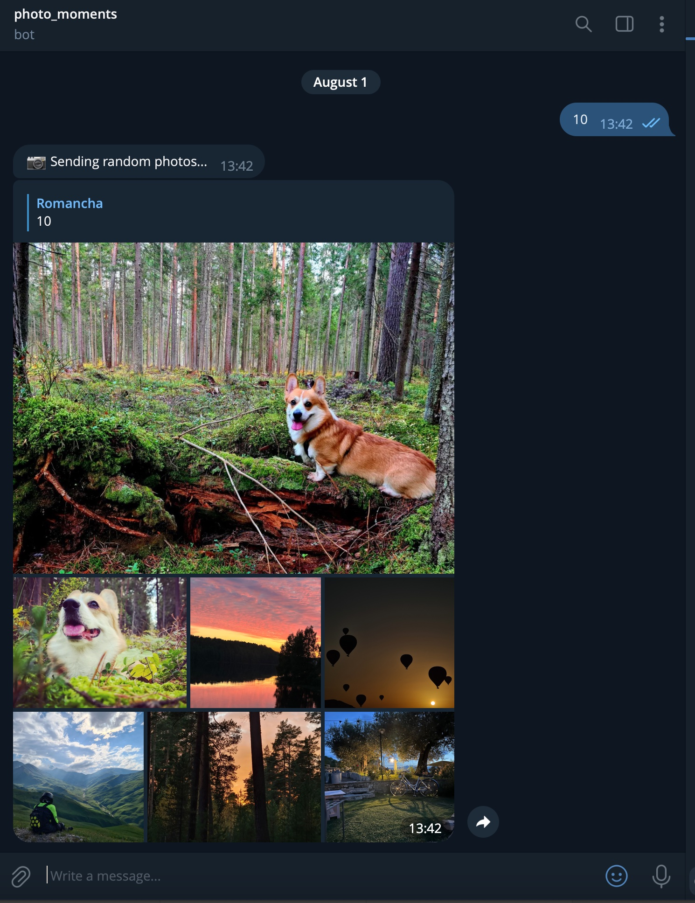
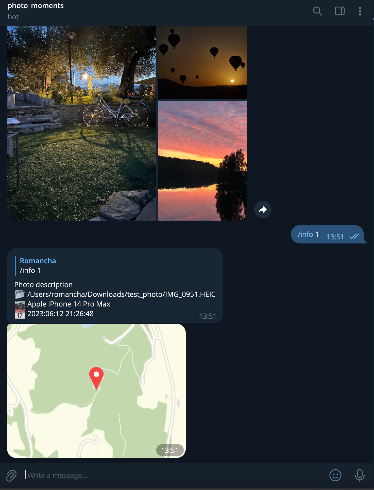

# Photo Moments Telegram Bot


[](https://github.com/Romancha/photo-moments-telegram-bot/blob/master/LICENSE)

<p align="center">
  <a href="https://github.com/Romancha/photo-moments-telegram-bot#photo-moments-telegram-bot">English</a> |
  <span>Русский</span>
</p>

## Введение

Photo Moments Telegram Bot отправляет случайные фотографии из вашей коллекции в Telegram, помогая вам вспомнить приятные
моменты.




## Возможности

- Отправка случайных фотографий из вашей библиотеки по расписанию [Cron](https://en.wikipedia.org/wiki/Cron).
- Запрос случайных фотографий через отправку сообщения боту с количеством фотографий или использование
  команды `/photo [count]`. Максимально 10 фотографий за один запрос.
- Просмотр фотографий, сделанных в этот день в прошлые годы с помощью команд `/memories [years]` или `/today`.
- Автоматическая отправка фотографий, сделанных в этот день в прошлые годы, по расписанию.
- Автоматическая еженедельная дифференциальная переиндексация для поддержания актуальности базы данных фотографий.
- Поддержка различных форматов изображений: `jpg`, `png`, `gif`, `webp`, `heic`.
- Автоматическое сжатие фотографий перед отправкой, если размер превышает 6 mb.
- Получение информации о фотографии - месторасположение, время, модель камеры, GPS координаты.

## Установка и использование

### Docker

Для запуска бота через docker compose необходимо:

1. Установить [Docker](https://docs.docker.com/get-docker/)
   и [Docker Compose](https://docs.docker.com/compose/install/).
2. Создать вашего бота и получить токен у [@BotFather](https://t.me/BotFather).
3. Узнать свой `chat_id` у [@userinfobot](https://t.me/userinfobot).
4. Заполнить [docker-compose.yml](/docker/docker-compose.yml) файл обязательными
   переменными ``FM_ALLOWED_USERS_ID``, ``FM_CHAT_ID``, ``FM_TG_BOT_TOKEN``, ``FM_DB_PATH``.
   https://github.com/Romancha/photo-moments-telegram-bot/blob/4ddf78c5b379473ae55b2b0327405199de3b0d81/docker/docker-compose.yml#L1-L11
5. Сконфигурировать ``volumes`` для указания расположения библиотеки фотографий на вашем устройстве.
6. Выполнить команду для запуска ``docker-compose up -d``.

Вы можете указать несколько папок с фотографиями, для этого вам нужно добавить несколько строк в ``volumes``:

```yaml
volumes:
  - /home/user/photos:/photoLibrary/
  - /home/user/photos2:/photoLibrary/
  - /home/user/photos3:/photoLibrary/
```

### Synology NAS

Для запуска бота на Synology NAS можно
использовать [Container manager](https://www.synology.com/en-us/dsm/packages/ContainerManager)
или [Docker](https://www.synology.com/en-global/dsm/packages/Docker).

### Запуск из исходников

Вы можете запустить бота, собрав его из исходников Go. Для работы бота необходима установленная библиотека для работы с
изображениями [libvips](https://www.libvips.org/).

## Конфигурация

| Параметр                 | Описание                                                                                                                                                                   |
|--------------------------|----------------------------------------------------------------------------------------------------------------------------------------------------------------------------|
| FM_TG_BOT_TOKEN          | Токен телеграм бота, полученный у [@BotFather](https://t.me/BotFather)                                                                                                     |
| FM_CHAT_ID               | Идентификатор чата, куда бот будет слать уведомления. Можно воспользоваться [@userinfobot](https://t.me/userinfobot) для получения id                                      |
| FM_ALLOWED_USERS_ID      | Идентификаторы пользователей телеграм, которые могут пользоваться ботом. Можно указать несколько id с разделителем ``;``                                                   |
| FM_PHOTO_PATH            | Путь до папки с библиотекой фотографий                                                                                                                                     |
| FM_DB_PATH               | Путь до файла БД. По умолчанию ``photo_moments.db``.                                                                                                                       |
| FM_PHOTO_COUNT           | Количество фотографий, которое будет отправлено ботом по расписанию. По умолчанию ``5``, максимум ``10``                                                                   |
| FM_SEND_PHOTOS_BY_NUMBER | Отправка фотографий по числу. По умолчанию ``true``                                                                                                                        |                                                                             
| FM_SEND_PHOTO_CRON_SPEC  | Расписание [Cron](https://en.wikipedia.org/wiki/Cron) для отправки случайных фотографий. По умолчанию ``0 10 * * *``                                                       |
| FM_MEMORIES_CRON_SPEC    | Расписание [Cron](https://en.wikipedia.org/wiki/Cron) для отправки фотографий, сделанных в этот день в разные годы. По умолчанию ``0 12 * * *``                            |
| FM_MEMORIES_PHOTO_COUNT  | Общее количество фотографий для отправки воспоминаний за все годы. По умолчанию ``5``                                                                                      |
| FM_REINDEX_CRON_SPEC     | Расписание [Cron](https://en.wikipedia.org/wiki/Cron) для автоматической дифференциальной переиндексации. По умолчанию ``0 0 * * 0`` (еженедельно в воскресенье в полночь) |

### Настройки прокси для Telegram (опционально)

| Параметр                 | Описание                                                                             |
|--------------------------|--------------------------------------------------------------------------------------|
| FM_TELEGRAM_PROXY_URL    | URL HTTP прокси для Telegram API (например, ``http://proxy:8080``)                   |
| FM_TELEGRAM_PROXY_USER   | Имя пользователя прокси (опционально)                                                |
| FM_TELEGRAM_PROXY_PASS   | Пароль прокси (опционально)                                                          |

## Команды

| Команда        | Описание                                                                                                                                            |
|----------------|-----------------------------------------------------------------------------------------------------------------------------------------------------|
| [number]       | Отправка случайных фотографий из библиотеки. ``number`` - количество фотографий                                                                     |
| /photo [count] | Отправка случайных фотографий из библиотеки. ``count`` - количество фотографий                                                                      |
| /memories      | Получение фотографий, сделанных в этот день 1 год назад                                                                                             |
| /memories N    | Получение фотографий, сделанных в этот день N лет назад                                                                                             |
| /today         | Получение фотографий, сделанных в этот день в разные годы                                                                                           |
| /indexing      | Показать текущий статус индексации метаданных фотографий                                                                                            |
| /reindex full  | Запустить полную переиндексацию фотографий (очистка и пересоздание индексов)                                                                        |
| /reindex diff  | Запустить дифференциальную индексацию (только новые и измененные файлы)                                                                             |
| /info [number] | Показать информацию о фотографии - месторасположение, камера, GPS локация. ``number`` - номер фотографии в последнем отправленном списке фотографий |
| /info          | Если это ответ на конкретную фотографию, показывает информацию о ней                                                                                |

## Контрибьютинг

Приветствуется вклад в улучшение этого проекта.

## Лицензия

Photo Moments Telegram Bot распространяется под лицензией Apache License 2.0 - [LICENSE](LICENSE)